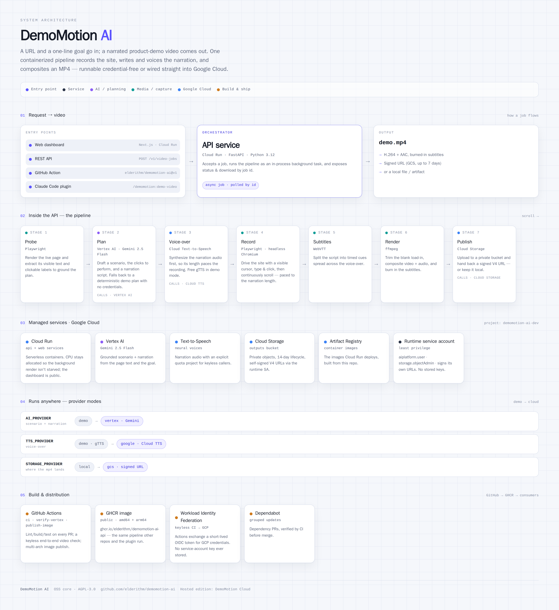
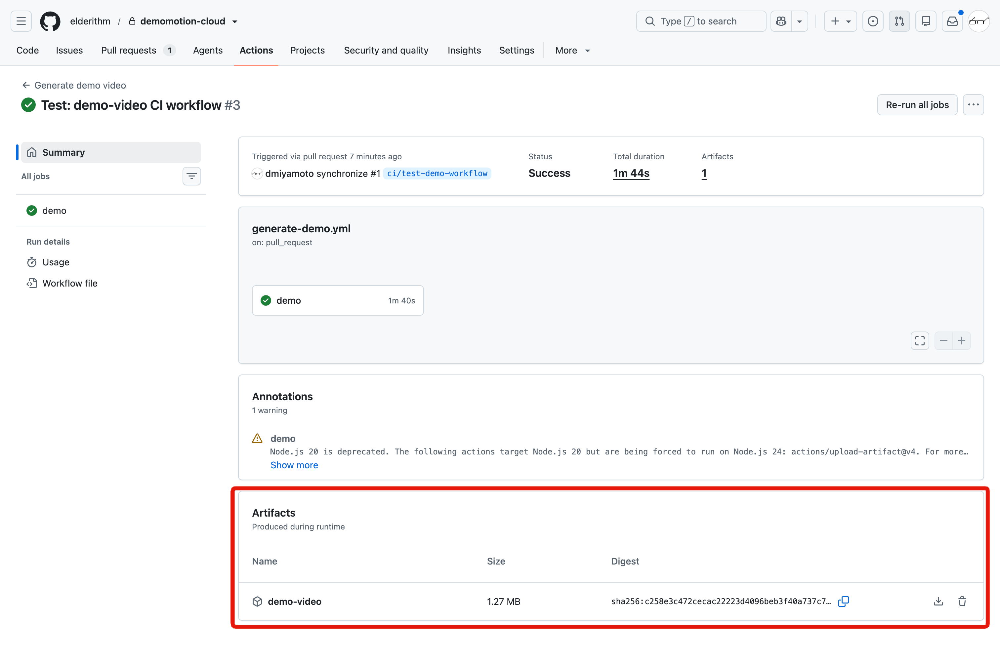
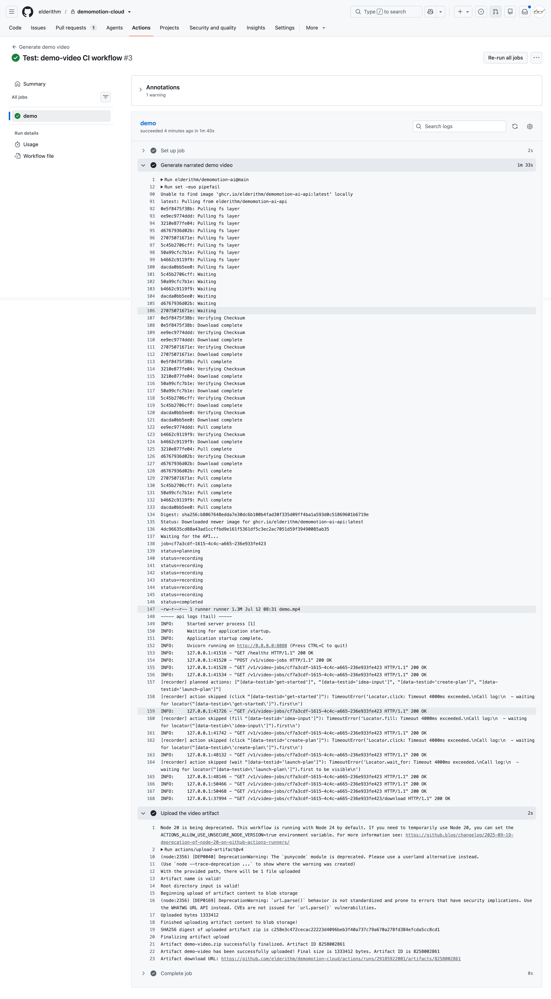

<div align="center">

# DemoMotion AI

**Turn a web app URL and a demo goal into a narrated product demo video.**

[](./LICENSE)


<br>

**☁️ Want the hosted version? [Join the DemoMotion Cloud waiting list →](https://demomotion-cloud-prod.web.app)**

**☁️ ホスティング版をご希望ですか？ [DemoMotion Cloud のウェイティングリストに登録 →](https://demomotion-cloud-prod.web.app)**

[](https://demomotion-cloud-prod.web.app)

<br>

**🇺🇸 English narration**


**🇯🇵 Japanese narration**


</div>

**DemoMotion AI** turns a web app URL and a demo goal into a narrated product demo video.

This repository is the open-source core, licensed under AGPL-3.0-or-later. A hosted commercial edition, **DemoMotion Cloud**, is in the works — [join the waiting list](https://demomotion-cloud-prod.web.app) to get early access.

## What it does

1. User enters a public web app URL and a demo goal.
2. The backend generates a browser action scenario.
3. A Playwright worker opens the site and records the screen.
4. Gemini generates a narration script and subtitles.
5. Google Cloud Text-to-Speech creates narration audio.
6. ffmpeg combines screen recording, narration, and subtitles into an MP4.
7. The result is saved locally in dev or to Cloud Storage in GCP.

## Architecture

<picture>
  <source media="(prefers-color-scheme: dark)" srcset="docs/architecture-dark.png">
  
</picture>

Entry points (web dashboard, REST API, the reusable GitHub Action, and the Claude
Code plugin) all hit one FastAPI service on Cloud Run, which runs the pipeline —
**probe → plan → voice-over → record → subtitles → render → publish** — and hands
back an MP4. Every cloud stage has a credential-free `demo` fallback, so the same
image runs locally or wired into Google Cloud.

## Providers

Each stage of the pipeline is a pluggable provider, selected by environment
variable, so the engine runs **credential-free by default** and a hosted build
can swap in cloud services:

| Variable | Default (`demo`) | Cloud |
| --- | --- | --- |
| `AI_PROVIDER` | `demo` — deterministic scenario for the bundled demo-app | `vertex` — Gemini plans the scenario + narration |
| `TTS_PROVIDER` | `demo` — free gTTS (falls back to a placeholder tone) | `google` — Google Cloud Text-to-Speech |
| `STORAGE_PROVIDER` | `local` — served from the API `/download` endpoint | `gcs` — Cloud Storage with a signed URL |

The default `demo` providers record the bundled demo-app and export an MP4 with
no Google Cloud access — ideal for local development, CI, and trying the engine.

## Monorepo layout

```txt
apps/
  web/       Next.js dashboard for creating video jobs and viewing results
    app/webmcp/    WebMCP collaborative workspace (/webmcp)
    lib/webmcp/    WebMCP tools, shared store, and backend adapter
  demo-app/  Small demo SaaS used as a zero-setup recording target
services/
  api/       FastAPI API + worker orchestration + Playwright/ffmpeg pipeline
infra/       Terraform for Google Cloud Run, Storage, Artifact Registry, IAM
docs/        Architecture notes
scripts/     Local helper scripts
```

## Quick start with Docker Compose

This is the recommended local setup.

### Prerequisites

- Docker Desktop or Docker Engine
- Docker Compose v2

### Start everything

```bash
docker compose up --build
```

Or:

```bash
make compose-up
```

Open:

- Web dashboard: http://localhost:3000
- Demo app: http://localhost:3001
- API docs: http://localhost:8080/docs

The dashboard is prefilled with the bundled demo app URL (`http://demo-app:3001`), so you can generate a video immediately. Replace it with any public URL to record your own app.

### Stop

```bash
docker compose down
```

To remove local Docker volumes as well:

```bash
docker compose down -v --remove-orphans
```

## Services in Docker Compose

```txt
web       Next.js dashboard on port 3000
api       FastAPI + Playwright + ffmpeg on port 8080
demo-app  Zero-setup demo SaaS recording target on port 3001
```

The local Docker setup uses the `demo` providers, so it does not require Gemini, Vertex AI, or Google Cloud credentials.

## Non-Docker local setup

### Prerequisites

- Node.js 20+
- pnpm 9+
- Python 3.12+
- uv or pip
- ffmpeg
- Chromium dependencies for Playwright

### Install

```bash
make install
```

### Run locally

Terminal 1:

```bash
make dev-api
```

Terminal 2:

```bash
make dev-demo
```

Terminal 3:

```bash
make dev-web
```

Then open http://localhost:3000. It is prefilled with `http://localhost:3001` (the demo app); replace it with any public URL to record your own app.

## Environment variables

`services/api/.env.example`:

```env
APP_ENV=local
AI_PROVIDER=demo
TTS_PROVIDER=demo
STORAGE_PROVIDER=local
GCP_PROJECT_ID=
GCP_LOCATION=asia-northeast1
GCS_BUCKET=
GOOGLE_APPLICATION_CREDENTIALS=
OUTPUT_DIR=./generated
PUBLIC_BASE_URL=http://localhost:8080
```

For Google Cloud / Gemini:

```env
AI_PROVIDER=vertex
TTS_PROVIDER=google
STORAGE_PROVIDER=gcs
GCP_PROJECT_ID=your-project-id
GCP_LOCATION=asia-northeast1
GCS_BUCKET=your-output-bucket
```

## Usage flow

1. Start Docker Compose (or the local services).
2. Open the web dashboard at http://localhost:3000.
3. Enter the public URL of the web app you want to record.
4. Set a goal, e.g. `Show how a founder can create a launch plan from a rough idea.`
5. Click **Generate demo video**.
6. Watch job progress.
7. Play or download the generated MP4.

## WebMCP Challenge 2026

DemoMotion AI exposes its demo-creation workflow to browser AI agents through
[**WebMCP**](https://webmcp.devpost.com/) (`document.modelContext`), so a human
and an agent can create, refine, and export a demo **together** in one shared
workspace — the agent uses structured tools while the human keeps editing the
same project by hand.

> Before WebMCP, an agent had to visually guess how to drive a demo-generation
> UI. With WebMCP, DemoMotion exposes structured creative actions while the human
> retains control of the same workspace.

### Try it (judge flow)

1. Start the stack (Docker Compose quick start above, or the local setup). The
   web app is on `http://localhost:3000`, the demo-app on `:3001`, the API on `:8080`.
2. Open **`http://localhost:3000/webmcp`** in a WebMCP-capable browser:
   - **Chrome 149+** with `chrome://flags/#enable-webmcp-testing` enabled, or
   - the **ChatGPT desktop app** browser.
   - Any other browser works too: [`@mcp-b/webmcp-polyfill`](https://www.npmjs.com/package/@mcp-b/webmcp-polyfill)
     installs a spec-compliant runtime automatically. The page shows whether it is
     using the **native** or **polyfill** runtime.
3. Confirm the **“WebMCP enabled”** badge and the five registered tools.
4. Ask the agent, e.g. *“Read this DemoMotion project and make the narration more
   concise.”* It calls `get_demo_state` → `create_demo` → `update_demo_narration`,
   and the workspace updates live.
5. Say *“Generate the final demo.”* → `generate_demo` runs the **real** pipeline
   (30–90s) and the MP4 appears.
6. Review it, then approve export. `export_demo` requires explicit confirmation
   and produces a **local** download only.

No Chrome extension and no cloud account are required — the default `demo`
providers record the bundled demo-app credential-free.

### WebMCP tools

Approximately one tool per meaningful action; each has a strict input schema,
clear success output, and structured errors (`INVALID_INPUT`,
`PROJECT_NOT_FOUND`, `GENERATION_FAILED`, `EXPORT_NOT_READY`,
`EXPORT_REQUIRES_CONFIRMATION`).

| Tool | Effect | Backend it adapts |
| --- | --- | --- |
| `get_demo_state` | Read-only workspace snapshot | — (shared client store) |
| `create_demo` | Start an editable draft (title, steps, first-pass narration) | `POST /v1/demo-drafts` |
| `update_demo_narration` | Rewrite narration/title; invalidates any stale video | shared store |
| `generate_demo` | Run the real pipeline to a narrated MP4 | `POST /v1/video-jobs` |
| `export_demo` | Local-only MP4 download, gated on human confirmation | `GET /v1/video-jobs/{id}/download` |

### What is new vs pre-existing

**Pre-existing DemoMotion (before 2026-08-25):** the entire generation pipeline
(probe → plan → voice-over → record → subtitles → render → publish), the web
dashboard at `/`, the bundled demo-app, the `POST /v1/video-jobs` REST API, the
pluggable providers, the Docker/Terraform deploy, the GitHub Action, and the
Claude Code plugin.

**New for the WebMCP Challenge (after 2026-08-25):**

- **WebMCP workspace** — the `/webmcp` route: `apps/web/app/webmcp/page.tsx`.
- **WebMCP adapter layer** — `apps/web/lib/webmcp/`: `registerTools.ts`, the five
  tools in `tools/`, the shared workspace `store.ts`, shared `actions.ts`, the
  backend client `api.ts`, and strict schema/result helpers in `result.ts`.
- **Reusable backend surface** the tools adapt over (no pipeline logic
  duplicated): `POST /v1/demo-drafts` (reuses the existing `ScenarioPlanner` +
  `NarrationWriter`, no recording) in `services/api/app/api/demo_drafts.py`, and
  optional `title_override` / `narration_override` on `VideoJobCreate` so a
  narration edited before generation actually reaches the rendered video.

WebMCP is an ecosystem/integration feature only. It adds no accounts, billing,
hosted storage, persistent share URLs, or Cloud-only capability — those remain
with [DemoMotion Cloud](https://demomotion-cloud-prod.web.app).

### Supported environment & known limitations

- **Secure context required:** WebMCP runs only on `https://` or `localhost`.
- **Runtime:** native in Chrome 149+ (testing flag) and the ChatGPT desktop
  browser; polyfilled elsewhere via `@mcp-b/webmcp-polyfill`.
- **Workspace state is per browser tab** (in-memory, local-first). It is not
  persisted or shared across viewers — persistent/hosted projects are Cloud-only.
- **`generate_demo` runs the real pipeline.** In `demo` provider mode it records
  the bundled demo-app deterministically; point it at any public URL to record
  that instead.
- **Basic auth on the hosted deployment:** if `BASIC_AUTH_USER` / `BASIC_AUTH_PASS`
  are set, the whole dashboard (including `/webmcp`) is gated, so run the agent in
  an already-authenticated browser tab. (Credentials are shared with judges at
  submission; leave the vars unset for a fully public deploy.)

## Recording sites that need a login

DemoMotion never handles your credentials. Instead, capture a browser session
once and reuse it (Playwright `storageState`):

```bash
make auth-capture URL=https://your-app.example.com
```

A real browser window opens — log in, then press Enter. The session is saved to
`auth/state.json`, which docker-compose mounts into the API; the recorder picks
it up automatically (`DEMOMOTION_AUTH_STATE`) and ignores it when absent.
`auth/state.json` holds session cookies, so it is gitignored — never commit it.

Automated login (login-form detection, 2FA, encrypted credential storage) is out
of scope for the OSS engine and belongs to a hosted edition.

## Deploy to Google Cloud

Trying it locally needs **no cloud** — the Docker Compose quick start runs the
`demo` providers. To run the full stack (Vertex AI narration, Cloud TTS, signed
URLs) on **your own Google Cloud project**, provision it with the Terraform in
[`infra/environments/dev`](infra/environments/dev). It creates Cloud Run (api +
web), Artifact Registry, a Cloud Storage bucket, a least-privilege runtime
service account, and the keyless-CI Workload Identity Federation pool — and
enables the required APIs.

**Prerequisites**

- A Google Cloud **project with billing enabled**.
- `gcloud`, `terraform`, and Docker installed, and authenticated:
  ```bash
  gcloud auth login
  gcloud auth application-default login   # lets Terraform use your credentials
  gcloud config set project YOUR_PROJECT_ID
  ```

**1 — Configure Terraform**

```bash
cd infra/environments/dev
cp example.tfvars terraform.tfvars
# edit terraform.tfvars: project_id, region, github_repository
# (basic_auth_user/pass are optional — leave empty for a public dashboard)
terraform init
```

**2 — Create the registry and base resources**

The Cloud Run services can't start until their images exist, so create the
registry (and enable APIs) first:

```bash
terraform apply \
  -target=google_project_service.apis \
  -target=google_artifact_registry_repository.repo
```

**3 — Build & deploy the API** (run the build from the repo root)

```bash
export PROJECT_ID=YOUR_PROJECT_ID REGION=asia-northeast1
bash scripts/build-api.sh            # builds services/api (linux/amd64) and pushes it

cd infra/environments/dev
terraform apply -target=google_cloud_run_v2_service.api
terraform output -raw api_url        # note this — the web build needs it
```

**4 — Build the dashboard against that API URL, then deploy everything**

The web bundle inlines the API URL at build time, so pass it as a build arg:

```bash
export PROJECT_ID=YOUR_PROJECT_ID REGION=asia-northeast1
export API_BASE_URL="https://…-an.a.run.app"   # the api_url from step 3
bash scripts/build-web.sh

cd infra/environments/dev
terraform apply                      # deploys web + finalizes everything
terraform output                     # web_url, api_url, bucket, wif_provider, ci_service_account
```

Open `web_url` — the dashboard is public by default (`allUsers` invoker). Set
`basic_auth_user`/`basic_auth_pass` in `terraform.tfvars` and re-apply to gate it.

**Redeploys**: rebuild + push the image (`scripts/build-api.sh` / `build-web.sh`)
and re-run `terraform apply`. On Apple Silicon the scripts build `linux/amd64`
images because Cloud Run runs amd64.

## Use it in your own CI

Other repos generate a video with the reusable GitHub Action — no need to clone
this repo:

```yaml
# .github/workflows/demo.yml in your repo
jobs:
  demo:
    runs-on: ubuntu-latest
    steps:
      - uses: elderithm/demomotion-ai@v1
        with:
          url: https://your-app.example.com
          goal: Explain the app for a first-time visitor, focusing on the key features.
      - uses: actions/upload-artifact@v4
        with: { name: demo-video, path: demo.mp4 }
```

The action pulls the published API image (`ghcr.io/elderithm/demomotion-ai-api`),
runs it on the runner, generates the video, and writes it to `demo.mp4`. A
copy-paste example lives in [`examples/github-actions/demo.yml`](examples/github-actions/demo.yml).

### Seen on GitHub Actions

Below is a complete workflow, running on a real pull request. No secrets are
needed for the default `demo` provider: the action pulls the **public**
`ghcr.io/elderithm/demomotion-ai-api` image and records entirely on the runner.

```yaml
# .github/workflows/generate-demo.yml
name: Generate demo video
on: pull_request

jobs:
  demo:
    runs-on: ubuntu-latest
    steps:
      - uses: elderithm/demomotion-ai@main
        with:
          url: https://your-app.example.com
          goal: Explain the app for a first-time visitor, focusing on the key features.
      - uses: actions/upload-artifact@v4
        with:
          name: demo-video
          path: demo.mp4
```

The job pulls the image, drives the site through the pipeline
(`planning → recording → completed`), writes `demo.mp4`, and uploads it as the
`demo-video` artifact — a green run with a downloadable video:



<details>
<summary>Full job log — pulling the public image and generating the MP4 on the runner</summary>



</details>

### Tailored narration with Gemini — keyless (recommended)

For narration tailored to your site you need Google Cloud. **Do not create a
service-account key.** Use keyless [Workload Identity Federation](https://github.com/google-github-actions/auth#preferred-direct-workload-identity-federation):
the runner's short-lived OIDC token is exchanged for temporary credentials, so
nothing long-lived is ever stored.

```yaml
permissions:
  contents: read
  id-token: write            # lets the runner mint an OIDC token
jobs:
  demo:
    runs-on: ubuntu-latest
    steps:
      - uses: google-github-actions/auth@v2   # keyless — no key file
        with:
          project_id: your-project-id
          workload_identity_provider: projects/123/locations/global/workloadIdentityPools/github/providers/github
      - uses: elderithm/demomotion-ai@v1
        with:
          url: https://your-app.example.com
          goal: Explain the app for a first-time visitor, focusing on the key features.
          ai_provider: vertex
          tts_provider: google
          storage_provider: gcs
          gcp_project_id: your-project-id
      - uses: actions/upload-artifact@v4
        with: { name: demo-video, path: demo.mp4 }
```

The action auto-detects the credentials the `auth` step provides and mounts them
into the container. A long-lived key (`google_credentials_json`) is still
accepted as a fallback, but discouraged.

### Recording the page you changed

Point `url` at the specific page (path included), from either:

- a per-PR **preview deploy** — pass its URL, e.g.
  `url: ${{ steps.deploy.outputs.preview-url }}/features/new-thing`
  ([`examples/github-actions/pr-preview.yml`](examples/github-actions/pr-preview.yml)); or
- the app **built and started on the runner** — the action uses `--network host`,
  so `url: http://localhost:3000/features/new-thing` works
  ([`examples/github-actions/run-on-runner.yml`](examples/github-actions/run-on-runner.yml)).

Put the change's intent in `goal` (e.g. "Introduce the new bulk-export feature")
so the narration reflects it, and use a `matrix` of paths to cover several
changed pages.

To post the result back to the PR:

- **Download link (default)** — upload the MP4 and comment its `upload-artifact`
  `artifact-url` with the real expiry date
  ([`examples/github-actions/pr-comment.yml`](examples/github-actions/pr-comment.yml)).
  The link requires sign-in, downloads a zip (not playable), kept ~90 days.
- **Playable link** — with `storage_provider: gcs`, the action returns a signed
  URL as its `video-url` output; comment that and clicking it plays the video in
  the browser ([`examples/github-actions/pr-comment-playable.yml`](examples/github-actions/pr-comment-playable.yml)).
  The signed URL is valid ~7 days (Cloud Storage V4 maximum). GitHub does not
  embed external videos inline, so it opens in a new tab.

Notes:
- The default `demo` providers need no credentials but produce generic narration.
- The `url` must be reachable from the GitHub runner (a public URL, a preview
  deploy, or a service you start on the runner). For login-gated pages, capture a
  session locally with `make auth-capture` and pass it via `auth_state_json`.
- Publishing: `.github/workflows/publish-image.yml` pushes the API image to GHCR
  on version tags. After the first publish, set the package to **Public** so
  consumers can pull it.

`.github/workflows/generate-demo.yml` is a self-contained variant that runs the
full stack from a checkout of this repo (handy for trying it here).

## Use it as a Claude Code plugin

This repo is a [Claude Code](https://claude.com/claude-code) plugin marketplace,
so you can record a demo from inside Claude Code. It wraps the same containerized
pipeline — the public `ghcr.io/elderithm/demomotion-ai-api` image runs locally
and writes an MP4.

**Install:**

```
/plugin marketplace add elderithm/demomotion-ai
/plugin install demomotion@demomotion-ai
/reload-plugins
```

Then, in any project, one command:

```
/demomotion:demo-video <url> <goal>
```

The `<url> <goal>` hint shows in the slash menu. You can also just ask in plain
language ("make a demo video of https://… showing …") and Claude runs it for you.

Requires Docker (plus `curl` and `python3`). The default `demo` provider needs no
credentials; for tailored Gemini narration, run `gcloud auth
application-default login` and add `--ai vertex --tts google --gcp-project <id>`.

**Run the script directly** (no Claude Code needed):

```bash
plugins/demomotion/scripts/generate.sh \
  --url https://your-app.example.com \
  --goal "Explain the app for a first-time visitor, focusing on the key features." \
  --output demo.mp4
```

Plugin layout: [`plugins/demomotion/`](plugins/demomotion/) (manifest +
`commands/demo-video.md` + `scripts/generate.sh`); the marketplace manifest is
[`.claude-plugin/marketplace.json`](.claude-plugin/marketplace.json).

## Docker notes

The API container uses the official Playwright Python image and installs ffmpeg, so Chromium recording works inside Docker. Generated files are stored in a Docker volume named `api_generated`.

In default `AI_PROVIDER=mock` mode, the app does not require Google Cloud credentials: it records the target site with Playwright, generates subtitles, creates a placeholder audio track, and exports an MP4. To generate cloud TTS narration, set `AI_PROVIDER=vertex` and configure Google Cloud credentials.

### Docker image Python compatibility

The API service uses `mcr.microsoft.com/playwright/python:v1.58.0-noble` and the API package declares `requires-python = ">=3.12,<3.15"`. This keeps the local Docker build on a modern Python line while avoiding accidental Python 3.10 installs.

### Rebuilding

If you previously ran an older Compose file that mounted shared `node_modules`, clean volumes first:

```bash
docker compose down -v
docker compose build --no-cache
docker compose up
```

## License

DemoMotion AI is licensed under AGPL-3.0-or-later. See [`LICENSE`](./LICENSE), [`NOTICE`](./NOTICE), and [`COMMERCIAL.md`](./COMMERCIAL.md).

The hosted SaaS edition should be kept in a separate private repository such as `demomotion-cloud` and may consume this repository as a git submodule or package dependency.
