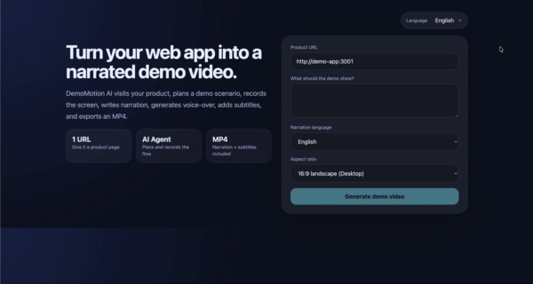
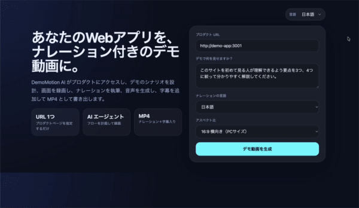

<div align="center">

# DemoMotion AI

**Turn a web app URL and a demo goal into a narrated product demo video.**

[](./LICENSE)


<br>

**☁️ Want the hosted version? [Join the DemoMotion Cloud waiting list →](https://demomotion-cloud-prod.web.app)**

[](https://demomotion-cloud-prod.web.app)

<br>

**🇺🇸 English narration**



**🇯🇵 Japanese narration**



</div>

**DemoMotion AI** turns a web app URL and a demo goal into a narrated product demo video.

This repository is the open-source core, licensed under AGPL-3.0-or-later. A hosted commercial edition, **DemoMotion Cloud**, is in the works — [join the waiting list](https://demomotion-cloud-prod.web.app) to get early access.

## What it does

1. User enters a public web app URL and a demo goal.
2. The backend generates a browser action scenario.
3. A Playwright worker opens the site and records the screen.
4. Gemini generates a narration script and subtitles.
5. Google Cloud Text-to-Speech creates narration audio.
6. ffmpeg combines screen recording, narration, and subtitles into an MP4.
7. The result is saved locally in dev or to Cloud Storage in GCP.

## Providers

Each stage of the pipeline is a pluggable provider, selected by environment
variable, so the engine runs **credential-free by default** and a hosted build
can swap in cloud services:

| Variable | Default (`demo`) | Cloud |
| --- | --- | --- |
| `AI_PROVIDER` | `demo` — deterministic scenario for the bundled demo-app | `vertex` — Gemini plans the scenario + narration |
| `TTS_PROVIDER` | `demo` — free gTTS (falls back to a placeholder tone) | `google` — Google Cloud Text-to-Speech |
| `STORAGE_PROVIDER` | `local` — served from the API `/download` endpoint | `gcs` — Cloud Storage with a signed URL |

The default `demo` providers record the bundled demo-app and export an MP4 with
no Google Cloud access — ideal for local development, CI, and trying the engine.

## Monorepo layout

```txt
apps/
  web/       Next.js dashboard for creating video jobs and viewing results
  demo-app/  Small demo SaaS used as a zero-setup recording target
services/
  api/       FastAPI API + worker orchestration + Playwright/ffmpeg pipeline
infra/       Terraform for Google Cloud Run, Storage, Artifact Registry, IAM
docs/        Architecture notes
scripts/     Local helper scripts
```

## Quick start with Docker Compose

This is the recommended local setup.

### Prerequisites

- Docker Desktop or Docker Engine
- Docker Compose v2

### Start everything

```bash
docker compose up --build
```

Or:

```bash
make compose-up
```

Open:

- Web dashboard: http://localhost:3000
- Demo app: http://localhost:3001
- API docs: http://localhost:8080/docs

The dashboard is prefilled with the bundled demo app URL (`http://demo-app:3001`), so you can generate a video immediately. Replace it with any public URL to record your own app.

### Stop

```bash
docker compose down
```

To remove local Docker volumes as well:

```bash
docker compose down -v --remove-orphans
```

## Services in Docker Compose

```txt
web       Next.js dashboard on port 3000
api       FastAPI + Playwright + ffmpeg on port 8080
demo-app  Zero-setup demo SaaS recording target on port 3001
```

The local Docker setup uses the `demo` providers, so it does not require Gemini, Vertex AI, or Google Cloud credentials.

## Non-Docker local setup

### Prerequisites

- Node.js 20+
- pnpm 9+
- Python 3.12+
- uv or pip
- ffmpeg
- Chromium dependencies for Playwright

### Install

```bash
make install
```

### Run locally

Terminal 1:

```bash
make dev-api
```

Terminal 2:

```bash
make dev-demo
```

Terminal 3:

```bash
make dev-web
```

Then open http://localhost:3000. It is prefilled with `http://localhost:3001` (the demo app); replace it with any public URL to record your own app.

## Environment variables

`services/api/.env.example`:

```env
APP_ENV=local
AI_PROVIDER=demo
TTS_PROVIDER=demo
STORAGE_PROVIDER=local
GCP_PROJECT_ID=
GCP_LOCATION=asia-northeast1
GCS_BUCKET=
GOOGLE_APPLICATION_CREDENTIALS=
OUTPUT_DIR=./generated
PUBLIC_BASE_URL=http://localhost:8080
```

For Google Cloud / Gemini:

```env
AI_PROVIDER=vertex
TTS_PROVIDER=google
STORAGE_PROVIDER=gcs
GCP_PROJECT_ID=your-project-id
GCP_LOCATION=asia-northeast1
GCS_BUCKET=your-output-bucket
```

## Usage flow

1. Start Docker Compose (or the local services).
2. Open the web dashboard at http://localhost:3000.
3. Enter the public URL of the web app you want to record.
4. Set a goal, e.g. `Show how a founder can create a launch plan from a rough idea.`
5. Click **Generate demo video**.
6. Watch job progress.
7. Play or download the generated MP4.

## Recording sites that need a login

DemoMotion never handles your credentials. Instead, capture a browser session
once and reuse it (Playwright `storageState`):

```bash
make auth-capture URL=https://your-app.example.com
```

A real browser window opens — log in, then press Enter. The session is saved to
`auth/state.json`, which docker-compose mounts into the API; the recorder picks
it up automatically (`DEMOMOTION_AUTH_STATE`) and ignores it when absent.
`auth/state.json` holds session cookies, so it is gitignored — never commit it.

Automated login (login-form detection, 2FA, encrypted credential storage) is out
of scope for the OSS engine and belongs to a hosted edition.

## Use it in your own CI

Other repos generate a video with the reusable GitHub Action — no need to clone
this repo:

```yaml
# .github/workflows/demo.yml in your repo
jobs:
  demo:
    runs-on: ubuntu-latest
    steps:
      - uses: elderithm/demomotion-ai@v1
        with:
          url: https://your-app.example.com
          goal: Explain the app for a first-time visitor, focusing on the key features.
      - uses: actions/upload-artifact@v4
        with: { name: demo-video, path: demo.mp4 }
```

The action pulls the published API image (`ghcr.io/elderithm/demomotion-ai-api`),
runs it on the runner, generates the video, and writes it to `demo.mp4`. A
copy-paste example lives in [`examples/github-actions/demo.yml`](examples/github-actions/demo.yml).

### Tailored narration with Gemini — keyless (recommended)

For narration tailored to your site you need Google Cloud. **Do not create a
service-account key.** Use keyless [Workload Identity Federation](https://github.com/google-github-actions/auth#preferred-direct-workload-identity-federation):
the runner's short-lived OIDC token is exchanged for temporary credentials, so
nothing long-lived is ever stored.

```yaml
permissions:
  contents: read
  id-token: write            # lets the runner mint an OIDC token
jobs:
  demo:
    runs-on: ubuntu-latest
    steps:
      - uses: google-github-actions/auth@v2   # keyless — no key file
        with:
          project_id: your-project-id
          workload_identity_provider: projects/123/locations/global/workloadIdentityPools/github/providers/github
      - uses: elderithm/demomotion-ai@v1
        with:
          url: https://your-app.example.com
          goal: Explain the app for a first-time visitor, focusing on the key features.
          ai_provider: vertex
          tts_provider: google
          storage_provider: gcs
          gcp_project_id: your-project-id
      - uses: actions/upload-artifact@v4
        with: { name: demo-video, path: demo.mp4 }
```

The action auto-detects the credentials the `auth` step provides and mounts them
into the container. A long-lived key (`google_credentials_json`) is still
accepted as a fallback, but discouraged.

### Recording the page you changed

Point `url` at the specific page (path included), from either:

- a per-PR **preview deploy** — pass its URL, e.g.
  `url: ${{ steps.deploy.outputs.preview-url }}/features/new-thing`
  ([`examples/github-actions/pr-preview.yml`](examples/github-actions/pr-preview.yml)); or
- the app **built and started on the runner** — the action uses `--network host`,
  so `url: http://localhost:3000/features/new-thing` works
  ([`examples/github-actions/run-on-runner.yml`](examples/github-actions/run-on-runner.yml)).

Put the change's intent in `goal` (e.g. "Introduce the new bulk-export feature")
so the narration reflects it, and use a `matrix` of paths to cover several
changed pages.

To post the result back to the PR:

- **Download link (default)** — upload the MP4 and comment its `upload-artifact`
  `artifact-url` with the real expiry date
  ([`examples/github-actions/pr-comment.yml`](examples/github-actions/pr-comment.yml)).
  The link requires sign-in, downloads a zip (not playable), kept ~90 days.
- **Playable link** — with `storage_provider: gcs`, the action returns a signed
  URL as its `video-url` output; comment that and clicking it plays the video in
  the browser ([`examples/github-actions/pr-comment-playable.yml`](examples/github-actions/pr-comment-playable.yml)).
  The signed URL is valid ~7 days (Cloud Storage V4 maximum). GitHub does not
  embed external videos inline, so it opens in a new tab.

Notes:
- The default `demo` providers need no credentials but produce generic narration.
- The `url` must be reachable from the GitHub runner (a public URL, a preview
  deploy, or a service you start on the runner). For login-gated pages, capture a
  session locally with `make auth-capture` and pass it via `auth_state_json`.
- Publishing: `.github/workflows/publish-image.yml` pushes the API image to GHCR
  on version tags. After the first publish, set the package to **Public** so
  consumers can pull it.

`.github/workflows/generate-demo.yml` is a self-contained variant that runs the
full stack from a checkout of this repo (handy for trying it here).

## Docker notes

The API container uses the official Playwright Python image and installs ffmpeg, so Chromium recording works inside Docker. Generated files are stored in a Docker volume named `api_generated`.

In default `AI_PROVIDER=mock` mode, the app does not require Google Cloud credentials: it records the target site with Playwright, generates subtitles, creates a placeholder audio track, and exports an MP4. To generate cloud TTS narration, set `AI_PROVIDER=vertex` and configure Google Cloud credentials.

### Docker image Python compatibility

The API service uses `mcr.microsoft.com/playwright/python:v1.58.0-noble` and the API package declares `requires-python = ">=3.12,<3.15"`. This keeps the local Docker build on a modern Python line while avoiding accidental Python 3.10 installs.

### Rebuilding

If you previously ran an older Compose file that mounted shared `node_modules`, clean volumes first:

```bash
docker compose down -v
docker compose build --no-cache
docker compose up
```

## License

DemoMotion AI is licensed under AGPL-3.0-or-later. See [`LICENSE`](./LICENSE), [`NOTICE`](./NOTICE), and [`COMMERCIAL.md`](./COMMERCIAL.md).

The hosted SaaS edition should be kept in a separate private repository such as `demomotion-cloud` and may consume this repository as a git submodule or package dependency.
